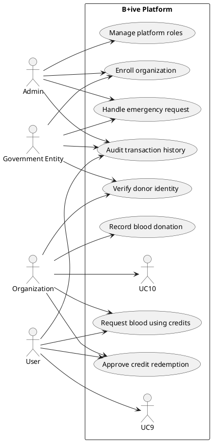

# B+ive Platform Architecture Overview

## Vision
B+ive is a blood-credit exchange network that enables donors, recipients, hospitals, and government entities to coordinate blood transfers through a credit-based ledger. Donors earn credits whenever they donate blood through a participating organization, and those credits can later be redeemed by themselves or other authorized users. Administrators and government agencies oversee compliance, verify identities, and manage participating organizations.

## Core Requirements
- **Role-based access** for administrators, government entities, organizations (hospitals/blood banks), and end users.
- **Blood credit ledger** that tracks donations and withdrawals at a fine-grained unit level (e.g., 100 ml = 1 credit).
- **Consent-driven transfers** so that credits can only be used with donor approval, with emergency override workflows for admins/government.
- **Traceability** for all transactions, linked to verified identity documents and medical history.
- **Emergency support** so admins/government entities can authorize urgent blood allocations even when no donor is immediately available.

## Recommended Technology Stack
| Layer | Recommendation | Rationale |
| --- | --- | --- |
| Frontend | **Next.js (React)** with TypeScript, Tailwind CSS, and React Query/TanStack Query | Next.js offers server-side rendering, API routes, and seamless deployment on Vercel. TypeScript improves reliability, Tailwind speeds UI development, and React Query simplifies data fetching. |
| Backend | **NestJS (Node.js + TypeScript)** or **Next.js API routes** for smaller deployments; integrates with REST/GraphQL | NestJS provides modular architecture, dependency injection, and mature authentication/authorization patterns. For a unified full-stack, Next.js API routes can cover early-stage needs. |
| Database | **MongoDB Atlas** (free tier) | Document model fits user profiles, credit ledgers, and transaction history. Offers serverless/auto-scaling plans and is included in GitHub Student Developer Pack. |
| Authentication | **NextAuth.js** or **Auth0** (Student plan), integrate Aadhaar/ID verification workflows as custom providers | Provides secure session management and supports role-based access. |
| Hosting | **Vercel** for the Next.js frontend/backend, **MongoDB Atlas** for data, optional **Render/Fly.io** for standalone NestJS services | Vercel has excellent support for Next.js and generous free tier; Render/Fly.io provide alternatives if background jobs or persistent processes are needed. |
| Messaging & Notifications | **Twilio SendGrid** (email/SMS) or **Firebase Cloud Messaging** | Supports donor consent prompts, emergency notifications, and status updates. |
| Infrastructure as Code | **Terraform** or **Pulumi** (later phases) | Enables repeatable environment setup when scaling beyond free tiers. |
| Monitoring | **Logtail**, **Sentry**, or **Vercel Analytics** | Observability for compliance and auditing.

## High-Level Architecture
```
+---------------------------+        +---------------------------+
|      Admin Portal         |        |   Government Portal       |
|  (Next.js frontend)       |        |  (role-scoped frontend)   |
+-------------+-------------+        +-------------+-------------+
              |                                   |
              v                                   v
        +------------------ API Gateway / Backend Service Layer ------------------+
        |  Authentication & Authorization (RBAC, OAuth, Aadhaar verification)     |
        |  Donation & Credit Ledger Service (transactions, balances, audits)      |
        |  Organization Management Service (enroll, verify, monitor hospitals)    |
        |  User Profile Service (ID docs, medical history, emergency contacts)    |
        |  Notification Service (consent requests, alerts, emergency escalations) |
        +----------------------+---------------------------+----------------------+
                                   |                       |
                                   v                       v
                          +------------------+   +-----------------------+
                          | MongoDB Atlas    |   | External Integrations |
                          |  - Users         |   |  - SMS/Email (Twilio) |
                          |  - Organizations |   |  - Identity APIs      |
                          |  - Credits       |   |  - Audit Storage      |
                          |  - Transactions  |   +-----------------------+
                          +------------------+
```

## Domain Model Overview
- **User**: Individual donor/recipient with verified identity, blood group, contact details, consent preferences, credit balance, emergency contacts.
- **Admin**: Platform superuser responsible for onboarding organizations and government entities, managing policies.
- **Government Entity**: Regulator with visibility into all transactions, authority to authorize emergency draws and compliance audits.
- **Credit Transaction**: Records credit earning (donation), debit (withdrawal), transfers, and emergency overrides.
- **Consent Request**: Pending approval from credit owner authorizing someone else to spend credits.
- **Emergency Case**: Special workflow triggered by admins/government to allocate blood without prior credit, capturing justification, repayment plan, and enforcement status.
- **Inventory Item**: Tracks per-organization stock levels (blood type, units, expiry), threshold alerts, and synchronization status with the ledger.
- **Inter-Organization Exchange**: Represents credit swaps between organizations, capturing requested/offered blood-type pairs, approvals, and reconciliation state.

## Consent Workflow
1. **Request initiation** – Organization staff select a beneficiary, specify the number of credits (in 100 ml units), and optionally attach clinical context.
2. **Notification delivery** – The credit owner receives a notification (email, SMS, in-app push) containing beneficiary details, requested amount, organization name, and expiry time.
3. **Review & decision** – Within the donor portal, the credit owner can approve or decline. Approvals require explicit confirmation plus optional notes; declines capture rationale for audit.
4. **Ledger update** – Only after approval does the ledger post a debit and emit receipts to the organization and donor. Declines leave the ledger untouched.
5. **Audit retention** – Consent artifacts (request payload, donor decision, timestamps, notifier delivery status) are stored immutably for future audits. Emergency overrides bypass donor consent but still log the administrator’s justification and repayment plan.

This per-transaction approach prevents blanket or standing approvals while maintaining a complete audit trail.

## Emergency Overrides
- **Synchronous debit** – Admins or government entities can execute an override that immediately debits credits, allowing the beneficiary balance to go negative.
- **Configurable ceiling** – A platform-wide policy (adjustable by admins) caps the maximum negative balance, defined in credits (100 ml units). Only one outstanding negative balance per beneficiary is allowed; the balance must return to ≥0 before another override is granted.
- **Repayment tracking** – Overrides store justification, repayment plan, repayment status, and follow-up timestamps. Progress updates transition the case from “Outstanding” to “Settled”.
- **UI indicators** – Portals display credit ≥0 in green and <0 in red, with banners summarizing outstanding debt and repayment commitments.
- **Notifications & audits** – Beneficiaries receive notifications about the debt and upcoming deadlines. All override actions are written to the audit log with actor identity, policy references, and supporting documents.

## Organizational Inventory Management
- **Stock capture** – Organizations maintain per-blood-type inventory records, including units, component (whole blood, plasma, etc.), collection date, expiry, and storage location.
- **Alerting** – Thresholds trigger alerts for low stock, impending expirations, or storage anomalies. Notifications route to organization staff and, if severe, administrators.
- **Synchronization with ledger** – Recording a donation increments both the ledger (crediting the donor) and the organization’s inventory. Fulfillment events decrement inventory while debiting the applicable donor’s credits. Background reconciliation jobs highlight mismatches for review.
- **Reporting** – Dashboards visualize trends, wastage, and forecasted demand to support inter-organization collaboration.

## Inter-Organization Credit Exchanges
- **Paired negotiation** – Organizations can negotiate exchanges using `(bloodType, credit)` pairs. Each proposal records what blood type and credit quantity is requested and what is offered in return.
- **Balancing uneven trades** – If pairs differ (e.g., A+ 2 credits for B 3 credits), the ledger tracks differential balances and can enforce make-up deliveries or administrative settlement.
- **Approval & audit** – Exchanges require approval from both organizations’ authorized representatives and, optionally, an overseeing admin/government reviewer. All steps, including negotiation messages and final sign-off, are logged.
- **Ledger impact** – Upon mutual approval, organizational ledgers update to reflect the new per-type credit holdings, while end-user credits remain untouched. Inventory transfers can be linked to exchanges to confirm physical stock movement.


## Use Case Diagram (PlantUML)


The diagram highlights that only organizations record donations and manage inventory, whereas end users focus on redeeming credits, reviewing history, and granting consent. The new “Manage blood inventory” use case reinforces operational responsibilities, and “View personal donation history” surfaces transparency without compromising data integrity.

## Component Responsibilities
- **Frontend Applications**: Distinct dashboards tailored to each role via RBAC. The public landing page features a 3D animated blood droplet (Three.js or Lottie animation) reinforcing the brand.
- **API Layer**: Validates requests, enforces consent, and orchestrates workflows. Uses JWT or session tokens with role/permission claims.
- **Ledger Service**: Ensures credits cannot be double-spent; exposes transactional endpoints to increment/decrement balances with audit trails, including negative-balance policies.
- **Inventory Service**: Manages stock entries, threshold alerts, and reconciliation jobs that cross-check ledger transactions.
- **Inter-Organization Exchange Service**: Facilitates negotiation, approval, and settlement of `(bloodType, credit)` swaps while preserving auditability.
- **Notification Service**: Sends OTPs, consent prompts, emergency alerts, debt reminders, and exchange updates through email/SMS/push notifications.
- **Analytics & Reporting**: Aggregates data for government oversight (donation trends, organization performance, compliance metrics).

## Development Roadmap
1. **Phase 1 – Discovery & Prototyping (current)**
   - Finalize requirements, user journeys, data model, and policy parameters (negative balance ceilings, consent SLA, exchange rules).
   - Build low-fidelity wireframes and validate with stakeholders.
   - Implement core authentication and role management in a proof-of-concept environment.
   - Exit criteria: architecture sign-off, consent/emergency policies approved, inventory schema agreed.
2. **Phase 2 – MVP**
   - Implement donation recording, credit ledger, per-transaction consent workflow, and basic dashboards for all roles.
   - Launch organizational inventory management and simple inter-organization exchange logging.
   - Integrate MongoDB Atlas and deploy initial version on Vercel (Next.js) or Render (NestJS API).
3. **Phase 3 – Compliance & Scaling**
   - Add audit logging, government reporting dashboards, emergency override enforcement tooling.
   - Integrate identity verification services, debt repayment tracking, and implement encryption at rest/in transit.
   - Automate reconciliation between ledger and inventory, and expand exchange settlement tooling.
4. **Phase 4 – Enhancements**
   - Introduce analytics, notification automation, and mobile-friendly PWA features.
   - Optimize performance, add caching (Redis), and consider microservice extraction if necessary.
   - Explore advanced collaboration features (marketplace-style exchange matching, predictive inventory analytics).

=======

User --> UC4
User --> UC5
User --> UC6
User --> UC8
@enduml
```

## Component Responsibilities
- **Frontend Applications**: Distinct dashboards tailored to each role via RBAC. The public landing page features a 3D animated blood droplet (Three.js or Lottie animation) reinforcing the brand.
- **API Layer**: Validates requests, enforces consent, and orchestrates workflows. Uses JWT or session tokens with role/permission claims.
- **Ledger Service**: Ensures credits cannot be double-spent; exposes transactional endpoints to increment/decrement balances with audit trails.
- **Notification Service**: Sends OTPs, consent prompts, and emergency alerts through email/SMS/push notifications.
- **Analytics & Reporting**: Aggregates data for government oversight (donation trends, organization performance, compliance metrics).

## Development Roadmap
1. **Phase 1 – Discovery & Prototyping**
   - Finalize requirements, user journeys, and data model.
   - Build low-fidelity wireframes and validate with stakeholders.
   - Implement core authentication and role management.
2. **Phase 2 – MVP**
   - Implement donation recording, credit ledger, consent workflow, and basic dashboards for all roles.
   - Integrate MongoDB Atlas and deploy initial version on Vercel (Next.js) or Render (NestJS API).
3. **Phase 3 – Compliance & Scaling**
   - Add audit logging, government reporting dashboards, emergency override workflows.
   - Integrate identity verification services and implement encryption at rest/in transit.
4. **Phase 4 – Enhancements**
   - Introduce analytics, notification automation, and mobile-friendly PWA features.
   - Optimize performance, add caching (Redis), and consider microservice extraction if necessary.


## Future-Proofing Considerations
- Design services with clean interfaces to allow migration to microservices or serverless functions as traffic grows.
- Store business rules in configurable policies so regulations can be updated without code changes.
- Maintain comprehensive documentation and automated testing (unit, integration, end-to-end) to facilitate long-term maintenance.
- Adopt CI/CD pipelines (GitHub Actions) early to enforce quality gates and streamline deployments.
